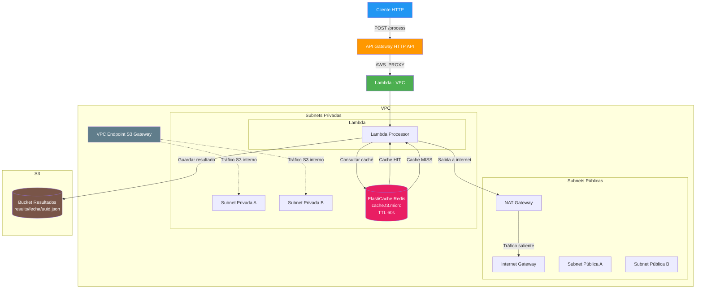

# Ejercicio Técnico SRE — Arquitectura Serverless en AWS

## Diagrama de Arquitectura



## Pre-requisitos

| Herramienta | Versión Mínima | Propósito |
|---|---|---|
| [Terraform](https://developer.hashicorp.com/terraform/downloads) | >= 1.5.0 | Despliegue de infraestructura como código |
| [AWS CLI v2](https://aws.amazon.com/cli/) | >= 2.0 | Autenticación con AWS |
| [Python](https://www.python.org/) | >= 3.12 | Código de la función Lambda |
| [pip](https://pip.pypa.io/) | >= 23.0 | Instalación de dependencias Python |
| Cuenta AWS | Con permisos de administrador | Creación de recursos AWS |

**Configuración de AWS CLI:**

```bash
aws configure
# AWS Access Key ID: ************
# AWS Secret Access Key: ************
# Default region: us-east-1
```

## Pasos de Despliegue

### 1. Clonar el repositorio

```bash
git clone <url-del-repositorio>
cd sre-ejercicio
```

### 2. Inicializar Terraform

```bash
terraform init
```

Esto descarga los providers de AWS y Archive.

### 3. Revisar el plan

```bash
terraform plan
```

Revisa que todos los recursos se vean correctos. El plan debe mostrar ~35 recursos a crear.

### 4. Desplegar

```bash
terraform apply
```

Confirma con `yes`. El despliegue toma aproximadamente **15 minutos** (lo más lento son el NAT Gateway y ElastiCache Redis).

### 5. Ver outputs

Al finalizar, Terraform mostrará las salidas:

```
api_endpoint = "https://xxxxxxxxx.execute-api.us-east-1.amazonaws.com"
lambda_function_name = "sre-test-processor"
s3_bucket_name = "sre-test-results-123456789012"
redis_endpoint = "sre-test-redis.xxxxxx.0001.use1.cache.amazonaws.com"
vpc_id = "vpc-xxxxxxxx"
private_subnet_ids = ["subnet-xxx", "subnet-yyy"]
```

## Verificación End-to-End

Los comandos se muestran para **Linux/macOS (bash)** y **Windows (PowerShell)**.

### 1. Configurar variable del endpoint

**Linux/macOS (bash):**
```bash
API_URL=$(terraform output -raw api_endpoint)
```

**Windows (PowerShell):**
```powershell
$apiEndpoint = terraform output -raw api_endpoint
```

### 2. Primer request (debe retornar MISS)

**Linux/macOS (bash):**
```bash
curl -s -X POST "$API_URL/process" \
  -H "Content-Type: application/json" \
  -d '{"data":"hello world"}' \
  -i
```

**Windows (PowerShell):**
```powershell
curl.exe -s -X POST "$apiEndpoint/process" -H "Content-Type: application/json" -d '{"data":"hello world"}' -i
```

**Respuesta esperada (ambos sistemas):**
```
HTTP/2 200
content-type: application/json
x-cache: MISS
access-control-allow-origin: *

{"input": "hello world", "output": "<sha256>", "timestamp": "2026-06-08T..."}
```

### 3. Segundo request idéntico (debe retornar HIT)

**Linux/macOS (bash):**
```bash
curl -s -X POST "$API_URL/process" \
  -H "Content-Type: application/json" \
  -d '{"data":"hello world"}' \
  -i
```

**Windows (PowerShell):**
```powershell
curl.exe -s -X POST "$apiEndpoint/process" -H "Content-Type: application/json" -d '{"data":"hello world"}' -i
```

**Respuesta esperada (ambos sistemas):**
```
HTTP/2 200
content-type: application/json
x-cache: HIT
access-control-allow-origin: *

{"input": "hello world", "output": "<sha256>", "timestamp": "2026-06-08T..."}
```

### 4. Verificar objetos en S3

**Linux/macOS (bash):**
```bash
aws s3 ls s3://$(terraform output -raw s3_bucket_name)/results/ --recursive
```

**Windows (PowerShell):**
```powershell
aws s3 ls "s3://$(terraform output -raw s3_bucket_name)/results/" --recursive
```

Debe mostrar un archivo JSON por cada request con cache MISS.

### 5. Ver logs de Lambda

**Linux/macOS (bash):**
```bash
aws logs tail /aws/lambda/$(terraform output -raw lambda_function_name) --since 5m
```

**Windows (PowerShell):**
```powershell
aws logs tail "/aws/lambda/$(terraform output -raw lambda_function_name)" --since 5m
```

## Decisiones de Diseño

### HTTP API vs REST API

**Decisión: HTTP API (v2).**

| Aspecto | HTTP API | REST API |
|---|---|---|
| Costo | ~$0.90/millón de requests | ~$3.50/millón de requests |
| Latencia | Menor (sin transformaciones) | Mayor (con transformaciones) |
| Autenticación IAM | No nativa | Sí |
| Transformaciones request/response | No | Sí |

HTTP API es la opción correcta para este caso porque:
- Solo necesitamos un endpoint POST sin autenticación IAM
- La integración proxy pasa todo a Lambda sin transformaciones
- El ahorro de ~71% en costo es significativo para un ejercicio
- Menor latencia = mejor experiencia en la demo

REST API se justificaría si necesitáramos: API Keys, WAF, transformaciones request/response, modelos de validación, o documentación Swagger automática.

### Tipo de nodo Redis: cache.t3.micro

- Suficiente para el volumen del ejercicio (una clave a la vez, TTL 60s)
- Entra en la capa gratuita de AWS (750 horas/mes durante 12 meses)
- T3.micro tiene burstable CPU, adecuado para cargas esporádicas
- Si el servicio escalara, se migraría a cache.t3.small o cache.r6g.large

### VPC Endpoint tipo Gateway para S3

**Gateway vs Interface:**

| Aspecto | Gateway | Interface |
|---|---|---|
| Costo | Gratis | $0.01/hora + $0.01/GB procesado |
| Servicios | Solo S3 y DynamoDB | 90+ servicios AWS |
| Rutas | Tabla de rutas | PrivateLink + ENI |

Elegimos Gateway porque:
- Es completamente **gratis** (Interface cuesta ~$7/mes + tráfico)
- Solo accedemos a S3 desde la VPC (no necesitamos otros servicios)
- Se integra directamente con la tabla de rutas privadas
- El tráfico nunca sale a internet

### Lambda en subnets privadas

- Reduce la superficie de ataque: Lambda no tiene IP pública
- El tráfico saliente pasa por el NAT Gateway (controlado)
- El tráfico a S3 va por el VPC Endpoint (nunca sale de AWS)
- Redis solo acepta conexiones desde el SG de Lambda

### Deployment package con Lambda Layer

- La librería `redis` no está en el runtime de Python 3.12 de Lambda
- Opción A: incluir redis en el zip de la función → zip grande (~5MB)
- Opción B: **Lambda Layer** (elegida) → zip de función pequeño (~1KB), capa reusable

Beneficio adicional: si otra función Lambda necesita redis, comparte la misma capa sin duplicar el código.

### Nombres con prefijo project_name

- Todos los recursos usan `${var.project_name}-` como prefijo
- Permite desplegar múltiples entornos (dev/staging/prod) sin conflictos
- Facilita identificar recursos relacionados en la consola AWS
- Las variables en `terraform.tfvars` permiten cambiar el prefijo sin modificar código

## Cómo destruir la infraestructura

```bash
terraform destroy
```

Confirma con `yes`. Esto eliminará todos los recursos creados.

**Importante:** El bucket S3 debe estar vacío para que `terraform destroy` funcione. Si hay objetos (de las pruebas), elimínalos primero:

**Linux/macOS (bash):**
```bash
aws s3 rm s3://$(terraform output -raw s3_bucket_name) --recursive
```

**Windows (PowerShell):**
```powershell
aws s3 rm "s3://$(terraform output -raw s3_bucket_name)" --recursive
```

## Posibles mejoras (producción)

- **State remoto**: Migrar el estado de Terraform a S3 + DynamoDB para trabajo en equipo
- **Secrets Manager**: Guardar credenciales de Redis si se requiere autenticación
- **DLQ**: Configurar una Dead Letter Queue para requests fallidos
- **Auto Scaling**: Habilitar concurrencia provisionada en Lambda para reducir latencia
- **Redis Cluster**: Modo cluster en producción para alta disponibilidad
- **API Key**: Agregar API Key en API Gateway para control de acceso
- **WAF**: Agregar AWS WAF para protección contra OWASP Top 10
- **CI/CD**: Pipeline automatizado con GitHub Actions + Terraform Cloud
